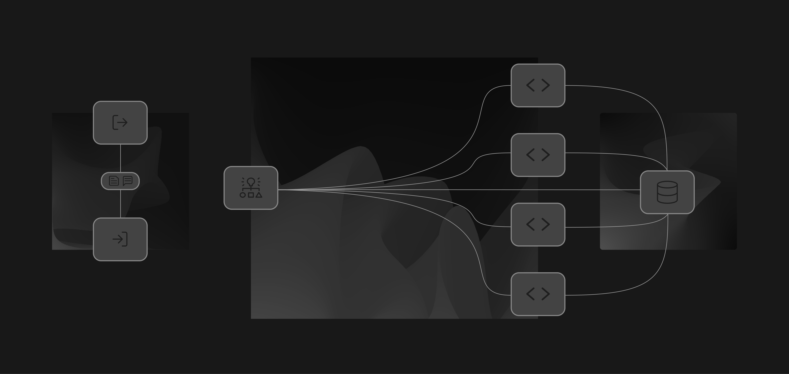

# Agentic Project Management (APM)

 

*Manage complex projects with a team of AI assistants, smoothly and efficiently.*

## What is APM?

**Agentic Project Management (APM)** is an AI workflow framework that brings real-world project management principles into your AI-assisted workflows. It addresses a fundamental challenge of LLMs: **context window limitations**.

### Audience Legend

- **👤 Human-only** – Reference material meant for operators, facilitators, or contributors.
- **🤖 Agent-ready** – Prompts and templates that can be pasted directly into an AI assistant.
- **🔁 Shared** – Assets that humans trigger or curate and that agents subsequently consume or update.

These icons also show up in generated automation outputs (for example, Rigorous APM's implementation plans and system-state files) so humans and agents see the same cues across tooling and documentation. The Rigorous workspace helper now auto-upgrades existing assets whenever it encounters an older file that is missing the shared legend.

APM uses various context retention techniques, coordinating a team of specialized AI agents in a structured way so that you can maintain productive AI-assisted work for longer periods before facing model hallucinations and needing to start over. When context window does fill up, APM ensures a smooth transition to a "fresh" chat session without important context loss.

Think of it like having a project manager, developers, ad-hoc specialists, and a setup/configuration expert all powered by AI and working together under your guidance.

  

## Getting Started

**Accessing APM Assets:** You have a few options to get the APM prompts, guides and protocol definitions:

1.  **👤 Use the APM Template (Recommended for Custom Projects):**
    *   Click the "Use this template" button on the [APM GitHub Repository](https://github.com/sdi2200262/agentic-project-management).
    *   This creates *your own repository* pre-filled with the entire APM structure.
    *   **Ideal Setup:** Clone *your new repository*, ideally at the root of your project workspace.

2.  **👤 Clone the Official APM Repository (Recommended for Direct Use & Updates):**
    *   Clone the main [APM GitHub Repository](https://github.com/sdi2200262/agentic-project-management) directly into your project workspace, ideally at the root.
    *   This gives you direct access to the latest version and all assets.

3.  **🤖 Manual Copy-Pasting (Basic Usage):**
    *   You can manually copy and paste prompt content (🤖) from the official APM GitHub repository into your AI assistant as needed. While this approach works, it involves more manual labor and does not fully leverage the agentic capabilities of the framework.

**Next Steps:**
1) See [Getting Started Guide](docs/Getting_Started.md) (👤) for complete setup instructions and your first APM session.
2) See [Workflow_Overview.md](docs/Workflow_Overview.md) (👤/🔁) for a complete understanding of all workflow protocols, procedures, and concepts.

## Documentation

APM v0.4 includes comprehensive documentation covering all aspects of the framework. Use the legend to decide what to read versus what to hand to an agent:

| Audience | Asset | Summary |
| --- | --- | --- |
| 👤 | **[Introduction](docs/Introduction.md)** | Overview of APM concepts, goals, and core framework. |
| 👤 | **[Getting Started Guide](docs/Getting_Started.md)** | Step-by-step setup and first session. |
| 👤 | **[Agent Types](docs/Agent_Types.md)** | Understanding the different agent roles. |
| 👤 / 🔁 | **[Workflow Overview](docs/Workflow_Overview.md)** | Complete workflow walkthrough including operator rituals and shared-state expectations. |
| 👤 | **[Token Consumption Tips](docs/Token_Consumption_Tips.md)** | Cost optimization strategies. |
| 👤 | **[Modifying APM](docs/Modifying_APM.md)** | Customization and advanced features. |
| 🔁 | **[Context & Memory Management](docs/Context_and_Memory_Management.md)** *(Advanced)* | How APM handles agent context and preserves key information. |
| 👤 / 🤖 | **[Context & Prompt Engineering](docs/Context_and_Prompt_Engineering.md)** *(Advanced)* | Prompt and Context Engineering techniques, including drag-and-drop agent snippets. |

## Contributing

APM is an open-source project, and your contributions are welcome! Whether it's improving prompts, enhancing documentation, suggesting new features, or reporting bugs, please feel free to open an issue or submit a pull request.

**Ways to contribute:**
- **Report bugs or workflow issues**
- **Suggest features or improvements**
- **Improve documentation or guides**
- **Share customizations/adaptations** for specific domains or IDEs

**Areas particularly seeking contributions:**

- **JSON Asset Format Testing:** APM v0.4 includes an experimental JSON asset format variant designed for better LLM parsing. If you have access to high token budgets or want to experiment with structured asset validation, testing the JSON format and providing feedback would be valuable for future development. See [Context & Prompt Engineering](docs/Context_and_Prompt_Engineering.md) documentation and [prompts/schemas/README.md](prompts/schemas/README.md) for detailed information and contribution guidelines.
 

- **Ad-Hoc Delegation Guides:** The framework currently includes Debug and Research delegation guides, but there's opportunity to create specialized guides for other context-intensive tasks such as testing automation, security analysis, data extraction and more. See [prompts/ad-hoc/README.md](prompts/ad-hoc/README.md) for contribution guidelines and template patterns.

Please read [CONTRIBUTING.md](CONTRIBUTING.md) for details on the code of conduct and contribution process.

## License

This project is licensed under the **Mozilla Public License 2.0** - see the [LICENSE](LICENSE) file for full details.

### License Update: MIT → MPL-2.0

As APM has matured from an experimental framework into a comprehensive multi-agent coordination system with growing commercial interest, its license has been upgraded from MIT to **Mozilla Public License 2.0 (MPL-2.0)**. This change helps protect the Open Source Software community while maintaining full commercial compatibility.

**What this means:** APM remains completely free and Open Source for all uses (personal, commercial, enterprise). You can build proprietary products using APM, integrate it into commercial IDEs, and create paid services around it. The only requirements are that improvements to core APM files must be shared back with the community, and that you attribute the creators and the APM project as required by the MPL 2.0 license. Make sure to read the [LICENSE](LICENSE) file for full details.

  

